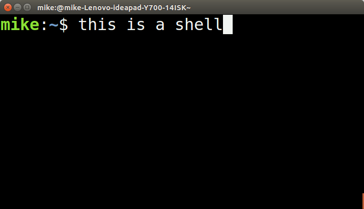

## Introduction



[Shell's](https://en.wikipedia.org/wiki/Shell_(computing)) (or sometimes called command-line interfaces) are text based applications that serve as an intermediate between the user and the operating system. The shell is also a tool for how a user interacts with the operating system. Previously, we have written many scripts that our shell can execute by running various programs. The shell that you build with this assignment will be something you can continually expand on in the future, and perhaps distribute as your own. Let us take a closer look at the parts to get started.

### Part 1 - Parser

1. It takes in a line of code (READ)
2. Parses the command (EVALUATES)
3. Then executes the command and its arguments (PRINT output)
4. Loops and then prints out any output. (LOOP)

We call this a [REPL interpreter](https://en.wikipedia.org/wiki/Read–eval–print_loop)

For the first part of this assignment, we are going to parse a line of text and break it into individual tokens (or [lexemes](https://en.wikipedia.org/wiki/Lexical_analysis#Lexeme)).

- The first token will be the command
- The second through *N* number of tokens will be any number of arguments.
- (Optionally) The N+1 tokens through M tokens will be another command with arguments.

More formally, a grammar describing how to parse each command looks like the following:

```command [args]* [ | commmand [args]* ]*```

- Note that there is a pipe ('|') command which designates another command follows.
- The star(asterisk) means that any number of arguments(zero to as infinite) could follow (See [Kleene star](https://en.wikipedia.org/wiki/Kleene_star)).

For part one of this assignment, write a program (**parse.c**) that contains functions to parse a single line of input and and prints out the individual tokens.

For example (See the line of input and the associated tokens separated onto a new line):

- *cd .*
  - ```
    cd
    .
    ```
- *ls -l*
  - ```
    ls
    -l
    ```
- *cat compile.py | head 2*
  - ```
    cat
    compile.py
    head
    2
    ```

### Part 2 - Signals

Provided below is a simple example that you can use.

```
#include <stdio.h>
#include <stdlib.h>
#include <signal.h> // This is new!


// Create a signal handler
void sigint_handler(int sig){
	write(1,"Terminating through signal handler\n",80);
	exit(0);
}

int main(){

	// Install our signal handler
	signal(SIGINT, sigint_handler);

	printf("You can only terminate by pressing Ctrl+C\n");

	while(1){
		printf("Running forever!\n");
		sleep(1);
	}

	return 0;
}
```

* The following page provides details about signals: https://ftp.gnu.org/old-gnu/Manuals/glibc-2.2.3/html_chapter/libc_24.html
* The following article provides a nice introduction as well: https://www.thegeekstuff.com/2012/03/catch-signals-sample-c-code/

### Part 3 - Mini-Shell

At a high level, implementing mini-shell takes the following components:
1. You will have a function that reads in commands a user types.
2. Your program will execute in an infinite loop.
3. Your program will execute child processes from the shell (the shell is the parent process) based on the command.

**The specifications for your shell**
1. You should have a prompt "mini-shell>" in front of each command that is typed out.
	- (If you want to be creative you can include the machine name or other information you can derive).
2. The maximum input size(i.e. BUFFER SIZE) will be 80 characters for our shell. You can specify this as a constant global variable.
3. Implement a signal handler so when the user presses 'Ctrl+C' the text 'mini-shell terminated' is printed out.
	- Make sure that all child processes are terminated when this occurs!
4. When you launch a new child process from your shell, the child process should run in the foreground by default until it is completed.
	- If a user launches a process with the '&' following it, then the child process should launch in the background.
	- Here are some examples: https://www.tutorialspoint.com/unix/unix-processes.htm
6. If the user adds the pipe '|' then the output of one process should be the input to the next process.
	- You can assume only one '|' will be used at most. `ls -l | wc`
	- Here are some examples: https://www.tutorialspoint.com/unix/unix-pipes-filters.htm
7. Users should be able to handle redirection ('<', '>') of standard input and output in your shell.
8. Your shell should have some built-in functions that you will have to implement. These include 'exit' to terminate your shell, 'cd' so you may change directories, and 'help' explaining all the built-in commands available in your shell.
	1. You can test `cd` by moving up or down the directory tree.
		- (Hint the C library has commands for this)
	2. `help` should print out all of the built-in commands that you provide.
	3. `exit` should terminate the shell
		- Note: If you launch another shell from within your shell, exit should only close out of the most recently launched shell.
9. You will want to think about how to store these built-in commands.
	- I will hint that using an array with commands and an array of function pointers is one possibly effective solution.
	- What is a function pointer? https://www.geeksforgeeks.org/function-pointer-in-c/
	- You can further think about what an array of function pointers looks like and why this may be appropriate.
10. If a command is not found, your shell should print out an error message, and resume execution.
	- e.g. `mini-shell>Command not found--Did you mean something else?`
11. You need to implement and document 1 addditional built-in command that you choose here.
	1. (Edit the readme below with your built-in command)

-----------------------------------------------------
NAME:

last [n]

SYNOPSIS:

The command returns/ prints the last n commands entered into the shell. If n is not specified it returns/ prints all the commands that were entered into the shell.

DESCRIPTION:

The shorthand for moving through the command history or the history command itself, is not supported by the mini shell, so the last command provides a method to simulate the history command. It also, provides the data structures to support the implementation for moving through the command history using arrow keys.

NOTES:

The crux of the implementation of the command is a linked-list. The linked-list stores all the commands that were entered into the shell. This is done inserting a new node at the beginning of the linked-list, so that the newly executed command is always at the top.<br>
When the command is called with an argument,(this must be an integer), the most recent n commands are printed, by traversing the linked-list for n elements(or the last element, whichever comes first). If no argument is specified, all the command in the stack are printed by traversing the entire linked-list.
